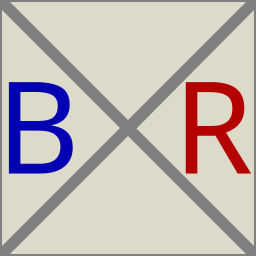

<p align="center"></p>

[](https://www.npmjs.org/package/bxr)
[](https://github.com/drom/bxr/actions/workflows/linux.yml)
[](https://github.com/drom/bxr/actions/workflows/macos.yml)
[](https://github.com/drom/bxr/actions/workflows/windows.yml)
[](https://coveralls.io/github/drom/bxr?branch=trunk)

## Overview

`bxr` is a **Box Layout Engine with Back-propagation**.

You describe a diagram as a nested [JsonML](http://www.jsonml.org/) array and `bxr`
returns an SVG string. Nested packing containers measure their children, size
themselves to fit, and place everything for you — no manual coordinates. A
back-propagation pass then resolves absolute positions and routes connections
between elements.

**Live examples:** [drom.io/bxr](http://drom.io/bxr/) · [basic](http://drom.io/bxr/basic.html)

## Installation

```sh
npm install bxr
```

## Usage

`bxr` takes an object `{bxr, config}` where `bxr` is the JsonML tree and
`config` holds defaults. `bxr(obj)` returns an SVG **string**; `wd(obj)` returns
a DOM element ready to append (used in the notebooks).

```js
import {bxr, wd} from 'bxr';

const svg = bxr({
  bxr: ['top',
    ['right',  'Star', 'Lennon', 'McCartney', 'Harrison'],
    ['center', 'Star', 'Lennon', 'McCartney', 'Harrison'],
    ['left',   'Star', 'Lennon', 'McCartney', 'Harrison']
  ],
  config: {padding: 4, opacity: .1, fill: '#000'}
});
```

### `config`

| key       | meaning                                  |
|-----------|------------------------------------------|
| `padding` | default gap around and between children  |
| `fill`    | default box fill                         |
| `stroke`  | default box stroke                       |
| `opacity` | default box `fill-opacity`               |

## Box packing

Six packing containers group their children and align them. Each is a JsonML
tag; children are the remaining array elements.

- **`left`, `center`, `right`** — stack children **vertically**, aligned to the
  left edge, center, or right edge.
- **`top`, `middle`, `bottom`** — stack children **horizontally**, aligned to the
  top edge, middle, or bottom edge.

An outer box is created automatically to fit all inner boxes or text.

```js
wd({bxr: ['top',
  ['right',  'Star', 'Lennon', 'McCartney', 'Harrison'],
  ['center', 'Star', 'Lennon', 'McCartney', 'Harrison'],
  ['left',   'Star', 'Lennon', 'McCartney', 'Harrison']
], config: {padding: 4, opacity: .1, fill: '#000'}})
```

Any container may take an options object as its first child:

| option    | meaning                                        |
|-----------|------------------------------------------------|
| `padding` | override `config.padding` for this container   |
| `reverse` | reverse child order                            |
| `fill` / `stroke` / `opacity` | override box style             |
| `multiple`| draw a stack of copies (see below)             |

## Text

A string child is rendered as centered text. Prefix it with `(rot<angle>)` to
rotate by `<angle>` degrees — the bounding box is recomputed to fit the rotated
text. Unicode is supported.

```js
wd({bxr: ['middle',
  ['top', 'Star 🥁'],
  ['top', '(rot30)Paul McCartney 🎹'],
  ['top', 'Lennon ☮'],
  ['top', 'Harrison 🎸']
], config: {padding: 8, opacity: .1, fill: '#000'}})
```

## Boxes and SVG elements

Use `box` for an explicit-size box, or any standard SVG element (`rect`,
`circle`, `line`, `path`, …). Two extra attributes declare the space to reserve:
**`w`** (width) and **`h`** (height); all other attributes pass through to SVG.

```js
wd({bxr: ['middle',
  ['box', {w: 60, h: 60}], ['box', {w: 20, h: 20}],
  ['center',
    ['box', {w: 20, h: 20}],
    'Hello',
    ['circle', {w: 32, h: 32, r: 16, cx: 16, cy: 16, fill: '#0a0'}]
  ]
], config: {padding: 5, opacity: .1, fill: '#000'}})
```

### `multiple` — stacked boxes

`multiple` draws a box as a stack of offset copies. Pass a count, or
`[count, dx, dy]` to control the offset (negative offsets stack the other way).

```js
['top', {fill: '#000', multiple: [3, 10, -10]}, 'Alice Copper']
```

## Wires, macros, and back-propagation

`bxr` supports **macros** — tags that expand into full sub-trees before layout.
The built-in `wire` macro builds gate drawings, input/output pins, labels, and a
routing channel from a compact description:

```js
wd({bxr: ['left', {fill: '#ddd', padding: 8},
  ['wire', {kind: '&', label: 'result', color: 'green'},
    ['wire', {label: 'argA'}],
    ['wire', {kind: '~'},
      ['wire', {kind: '=1'},
        ['wire', {kind: '^'},
          ['wire', {label: 'argB'}],
          ['wire', {label: 'argC'}]
        ],
        ['wire', {label: 'argD'}],
        ['wire', {label: 'argE'}]
      ]
    ]
  ]
], config: {}})
```

After packing, the **back-propagation** pass:

1. **resolves transforms** — walks the tree, propagating each container's
   `translate` down into its children so every element gets an absolute position;
2. **routes connections** — collects `input`/`output` pins (matched by id) so
   wires can be drawn between the boxes that produce and consume them.

This is what lets a purely declarative, nested description turn into a fully
positioned and connected diagram.

## License

[MIT](./LICENSE)
